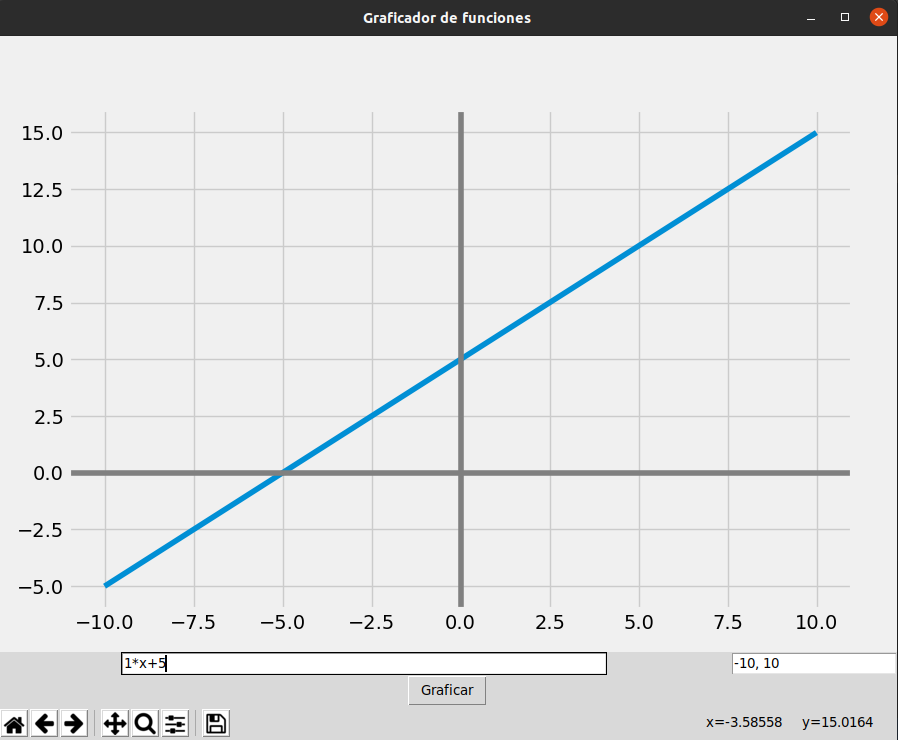
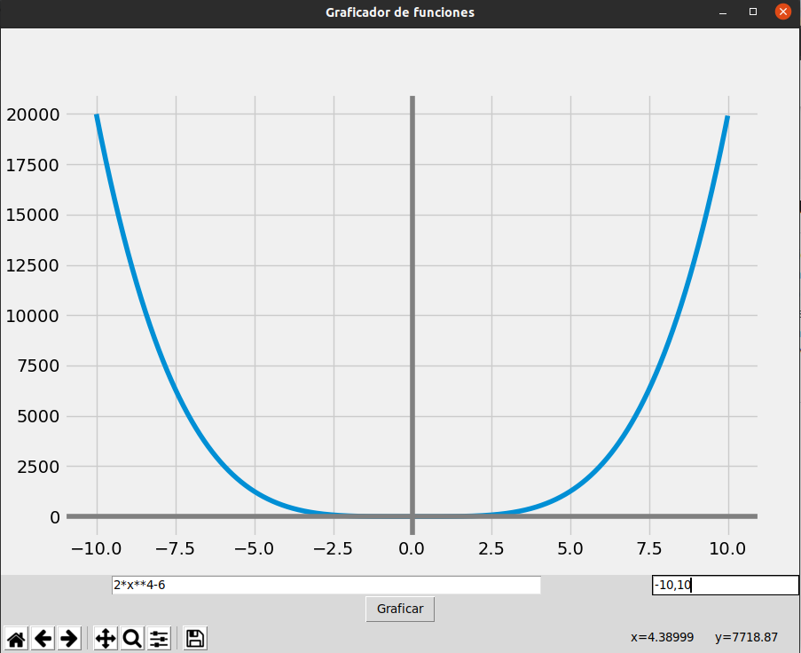
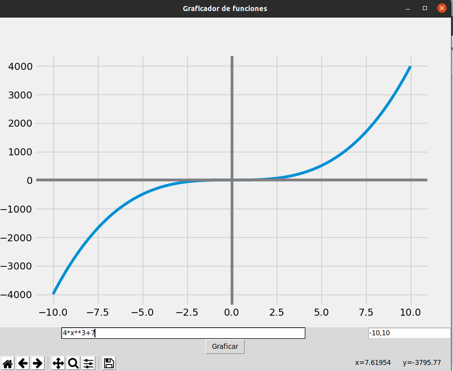
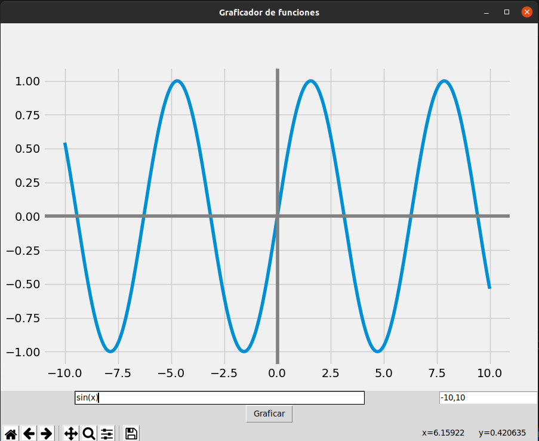

### FUNCIONES MATEMATICAS 

## GRAFICAS 

# FUNCION LINEAL 
- La función lineal es la representación de la relación entre dos variables. Esta representación la podemos realizar a través de un enunciado de una situación problemática, una fórmula matemática o de una gráfica en el plano cartesiano. La gráfica resultante va a ser una linea recta.

# FUNCION CUDRATICA 
- Resultado de imagen para funcion cuadratica
Una función cuadrática es un tipo de función que se caracteriza por ser un polinomio de segundo grado. En otras palabras, una función cuadrática es una función que en la que uno de los elementos lleva un 2 pequeño como índice superior. Una función cuadrática también recibe el nombre de función de segundo grado.

# FUNCION CUBICA 

- Resultado de imagen para FUNCION CUBICA
Función cúbica Función cúbica es una función polinómica de grado 3. Su expresión matemática es f(x) = ax3 + bx2 + cx + d. Características de la función cúbica - Intercepto con eje Y: punto (0, d). El número d de la función corresponde al término independiente.

# FUNCION LOGARITMICA 

- Las funciones logarítmicas son funciones del tipo f(x)=logax, donde a (la base) es un número real mayor que cero y distinto de 1. Tiene las siguientes características generales: a) El dominio será todos los valores que hacen positivo la expresión dentro del logaritmo. b) El recorrido es R.

# FUNCION EXPONENCIAL 

- se caracterizan únicamente por el hecho de que la tasa de crecimiento de dicha función (es decir, su derivada) es directamente proporcional al valor de la función.

# FUNCION TRIGONOMETRICA

- son las funciones cuyo argumento, o variable independiente, es un ángulo. Estas usualmente incluyen términos que describen la medición de ángulos y triángulos, tal como seno, coseno, tangente, cotangente, secante y cosecante.

